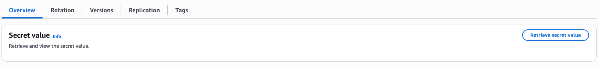

# Chainguard Interview Environment

Shamelessly cannibalized from the [EKS Workshop](https://github.com/aws-samples/eks-workshop-v2).

## Overview

This repository provides an isolated interview environment for each candidate, consisting of:
- A browser-based IDE (code-server) running on EC2
- An EKS cluster for Kubernetes-based interview scenarios
- Pre-configured tools and utilities (kubectl, helm, eksctl, etc.)

Each interviewee gets their own dedicated environment by using an `environment` parameter.

## Prerequisites

The setup process requires local AWS credentials with permissions to create CloudFormation stacks, IAM roles, EC2 instances, and EKS clusters:

```shell
aws sts get-caller-identity
```

Clone the repository to your local environment:

```shell
git clone https://github.com/JoeNorth/cg-interview-environment.git && cd cg-interview-environment
```

## Deployment Instructions

### Deploy an IDE for a Specific Interviewee

To support multiple concurrent interviews, use the `environment` parameter to create isolated environments. This will prefix all resources with a unique identifier:

```shell
# For interviewee Alice
make deploy-ide candidate=alice

# For interviewee Bob
make deploy-ide candidate=bob
```

**Naming Convention:**
- Without `candidate`: Creates resources named `cg-interview-*`
- With `candidate=alice`: Creates resources named `cg-interview-alice-*`

This allows multiple interview environments to coexist in the same AWS account without conflicts.

### Deploy a Single/Default Environment

If you only need one environment or are testing, you can omit the candidate parameter:

```shell
make deploy-ide
```

This creates resources with the default name `cg-interview-*`.

### Advanced Deployment Options

#### Using a Custom Git Branch

By default, the IDE environment fetches scripts and configurations from the `main` branch. To test changes from a different branch, use the `branch` parameter:

```shell
# Deploy using a feature branch
make deploy-ide candidate=alice branch=feature-new-tools

# Test branch changes without a specific candidate
make deploy-ide branch=experimental
```

This is useful when:
- Testing infrastructure changes before merging to main
- Deploying candidate-specific customizations
- Running multiple environment variants for different interview types

**What it does**: The `branch` parameter sets the `RepositoryRef` CloudFormation parameter, which controls which git branch is used to fetch:
- Installation scripts (`installer.sh`, `setup.sh`, etc.)
- Cluster configuration files
- Interview question materials

#### Preview Deployment with Dry-Run Mode

Before deploying, you can preview the CloudFormation template and verify parameters using dry-run mode:

```shell
# Preview deployment for a specific candidate
make deploy-ide candidate=alice dry-run=true

# Preview with custom branch
make deploy-ide candidate=bob branch=feature-x dry-run=true

# Preview default deployment
make deploy-ide dry-run=true
```

**Dry-run output includes**:
- Candidate name (auto-generated if not specified)
- Branch/repository reference
- Cluster name that would be created
- Complete CloudFormation template rendered to stdout

**When to use dry-run**:
- Verifying naming conventions before creating resources
- Reviewing IAM policies and permissions
- Debugging CloudFormation template issues
- Documenting the infrastructure as code

**Note**: Dry-run mode does NOT create any AWS resources or make any API calls. It only renders and displays the template that would be deployed.

### Access the IDE

1. **Find the CloudFormation Stack**

   Go to the [CloudFormation Console](https://us-west-2.console.aws.amazon.com/cloudformation/home) and find your stack:
   - With candidate parameter: `cg-interview-<candidate>-ide` (e.g., `cg-interview-alice-ide`)
   - Without candidate parameter: `cg-interview-ide`

2. **Retrieve the Password**

   From the CloudFormation stack, go to the **Outputs** tab and click the `IdePasswordSecret` link. This takes you to Secrets Manager.

   Click **Retrieve secret value** to see the IDE password. Copy it to your clipboard.

   

3. **Access the IDE**

   From the CloudFormation stack's **Outputs** tab, click the `IdeUrl` link. This opens the code-server login page.

   Enter the password from Secrets Manager and click **Login**.

### Create the EKS Cluster

Once logged into the code-server IDE, open the terminal and run:

```bash
create-cluster
```

This command will:
- Create an EKS cluster with 3 worker nodes
- Configure kubectl to connect to the cluster
- Install necessary Kubernetes resources
- Deploy a WordPress Helm chart for interview scenarios

The cluster creation takes approximately 15-20 minutes.

### Complete Interview Setup

Follow the interview guide to:
1. Clone the necessary repositories for interview materials
2. Deploy interview-specific applications to the cluster
3. Provide the IDE URL and password to the candidate

## Managing Multiple Environments

### List Active Environments

View all active interview environments:

```shell
aws cloudformation list-stacks --stack-status-filter CREATE_COMPLETE UPDATE_COMPLETE \
  --query 'StackSummaries[?starts_with(StackName, `cg-interview`)].StackName' --output table
```

### Cleanup After Interview

When an interview is complete, destroy the environment to free up AWS resources:

```shell
# For a specific environment
make destroy-ide candidate=alice

# For the default environment
make destroy-ide
```

**Note:** The `destroy-ide` command removes the IDE infrastructure but does NOT delete the EKS cluster. If a cluster was created, it must be deleted separately from within the IDE:

1. Log into the IDE
2. Run `delete-cluster` in the terminal
3. Wait for cluster deletion to complete (~10 minutes)
4. Then run `make destroy-ide candidate=<name>` from your local machine

Alternatively, manually delete the cluster and associated resources from the AWS console.

## Troubleshooting

### Wrong AWS Region

By default, all resources are created in `us-west-2`. To use a different region:

```shell
export AWS_REGION=us-east-1
make deploy-ide environment=alice
```

### CloudFormation Stack Not Found

Ensure you're looking in the correct region (us-west-2 by default) and using the correct stack name pattern (`cg-interview-<environment>-ide`).

### Cannot Access IDE URL

Check the security group rules in the CloudFormation stack. The IDE is accessible from any IP address (0.0.0.0/0) on port 80.

## Architecture

For detailed architecture information, see [CLAUDE.md](CLAUDE.md).
